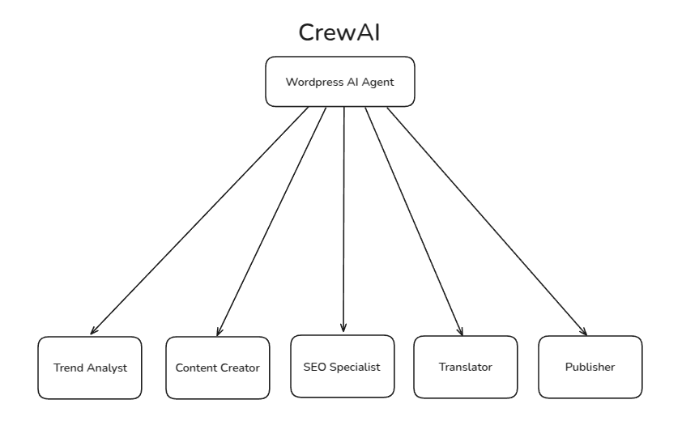

# CrewAI WordPress Article Generator

An automated content creation system that generates SEO-optimized, casual-friendly articles and publishes them directly to WordPress. The system uses CrewAI to orchestrate multiple AI agents that handle different aspects of the content creation pipeline.


**Watch the Demo**


## 🌟 Features

- Trend analysis and research
- SEO-optimized content creation
- Casual and friendly writing style
- Multi-language support with cultural adaptation
- Automated WordPress publishing
- Modular agent-based architecture

## 📋 Prerequisites

- Python 3.8+
- [OpenAI API key](https://platform.openai.com/settings/organization/api-keys) for LLM activation
- [SerperDev API key](https://serper.dev/api-key) for research
- [WordPress REST API credentials](https://make.wordpress.org/core/2020/11/05/application-passwords-integration-guide/) which can be generated from an Edit User page (wp-admin -> Users -> Edit User)

## 🔧 Installation

1. Clone the repository:

```bash
git  clone  https://github.com/harrylicious/ai-wordpress-agent
cd  ai-wordpress-agent
```

2. Install required packages:

```bash
pip  install crewai crewai-tools python-dotenv requests fastapi uvicorn
```

3. Set up your environment variables in a `.env` file:

```env
OPENAI_API_KEY=your_openai_api
SERPER_API_KEY=your_serper_api_key
WORDPRESS_URL=your_wordpress_site_url
WORDPRESS_USERNAME=your_admin_username
WORDPRESS_PASSWORD=your_admin_password
```

## 🚀 Usage

- Start server _uvicorn main:app --host 0.0.0.0 --port 8000_
- Access server http://0.0.0.0:8000/docs
- **Try out!**

## 🤖 Agent Roles

1.  **Trend Analyst**

- Researches current trends
- Identifies viral content opportunities
- Analyzes audience interests

2.  **Content Creator**

- Writes engaging, casual content
- Uses conversational tone
- Incorporates storytelling elements

3.  **SEO Specialist**

- Optimizes content for search engines
- Maintains readability
- Implements keyword strategy

4.  **Language Adapter**

- Translates content
- Adapts cultural references
- Maintains tone across languages

5.  **Content Publisher**

- Formats content for WordPress
- Handles meta information
- Manages publication process

## 📝 Task Workflow

1. Trend Analysis

- Research current trends
- Identify viral angles
- Gather key insights

2. Content Creation

- Write engaging content
- Maintain casual tone
- Include relatable examples

3. SEO Optimization

- Integrate keywords
- Structure content
- Add meta information

4. Translation

- Translate content
- Adapt cultural elements
- Preserve SEO value

5. Publishing

- Format content
- Set up meta data
- Publish to WordPress

## 🛠️ Tools Used

- `WordPressUploadTool`: Handles WordPress REST API interactions
- `SerperDevTool`: Provides search and research capabilities

## 📁 Project Structure

```

ai-wordpress-agent/

├── crew_logic.py # Main crew and agent definitions
├── main.py # Main file
├── tools/
│ └── wordpress_upload_tool.py # WordPress interaction tool
│ └── __init__.py
├── .env # Environment variables
└── README.md # This file

```

## ⚙️ Configuration

The system can be configured through environment variables:

- `WORDPRESS_URL`: Your WordPress site URL
- `WORDPRESS_USERNAME`: WordPress admin username
- `WORDPRESS_PASSWORD`: WordPress admin password
- `SERPER_API_KEY`: SerperDev API key for research

## 🤝 Contributing

1. Fork the repository
2. Create a feature branch
3. Commit your changes
4. Push to the branch
5. Create a Pull Request

## 📜 License

This project is licensed under the MIT License - see the LICENSE file for details.

## ⚠️ Important Notes

- Ensure your WordPress REST API is properly configured
- Keep your API keys and credentials secure
- Monitor your API usage to stay within limits
- Test translations before production use

## 🐛 Troubleshooting

Common issues and solutions:

1. WordPress API Connection:

- Verify WordPress REST API is enabled
- Check credentials in .env file
- Ensure proper permissions are set

2. Content Generation:

- Monitor agent outputs for errors
- Verify API keys are valid
- Check language code format

3. Publishing Issues:

- Verify WordPress user permissions
- Check post status settings
- Monitor WordPress error logs

## 🔄 Updates and Maintenance

- Regularly update dependencies
- Monitor CrewAI version changes
- Keep API keys current
- Review WordPress compatibility
  For additional support or questions, please open an issue in the repository.

## ☕ Support and Reward

- [Saweria](https://saweria.co/harrylicious)
- [Buy me a coffe](https://buymeacoffee.com/harrylicious)
